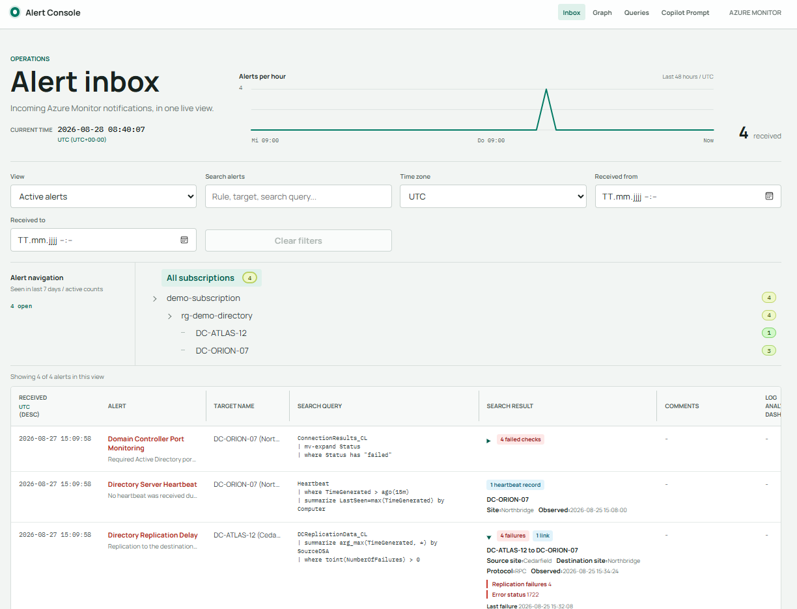
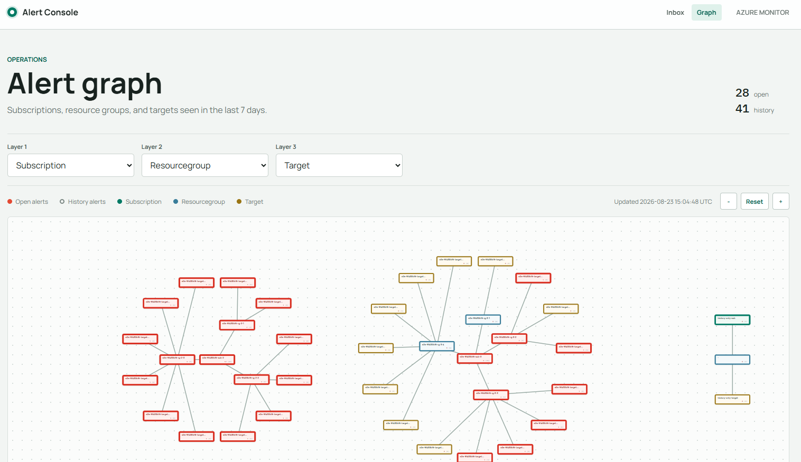

\## Welcome to the Azure Monitoring project

The main parts of the solution are: 

\- a web interface based on Blazor

\- an api endpoint to receive REST Messages from Azure Monitor alerts or Logic Apps

\- a graph based interface to query for data in an automated way

\- a console app to demo the usage of the graph interface for the Monitoring app

The Web Interface is shown here

